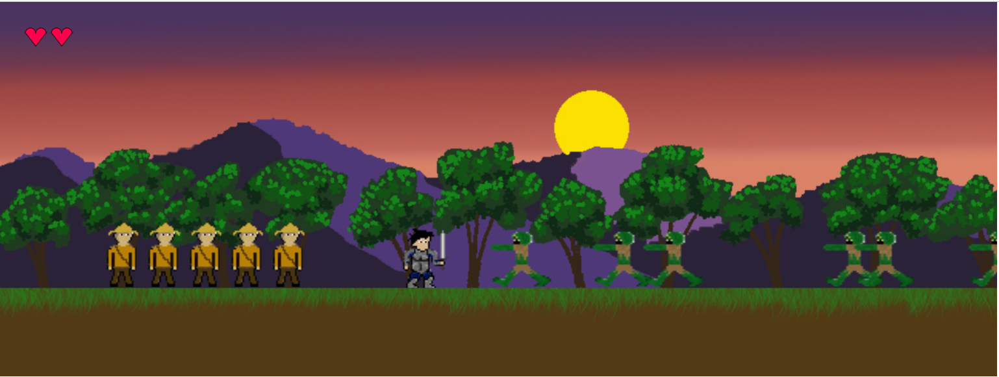

This final was a lot of fun, and very challenging. Even with starting well in advance, it still came down to the last few hours. Some aspects of my original design did not turn out in the final draft. However, this version of the game is fully functional and fun to play. Which was my primary goal to start with.
The final took me around 300 lines of code to pull off. (including notes and edits within)

PDF (Unfinished)

Video: https://www.youtube.com/watch?v=7JsXXYDIczA&t=2s
